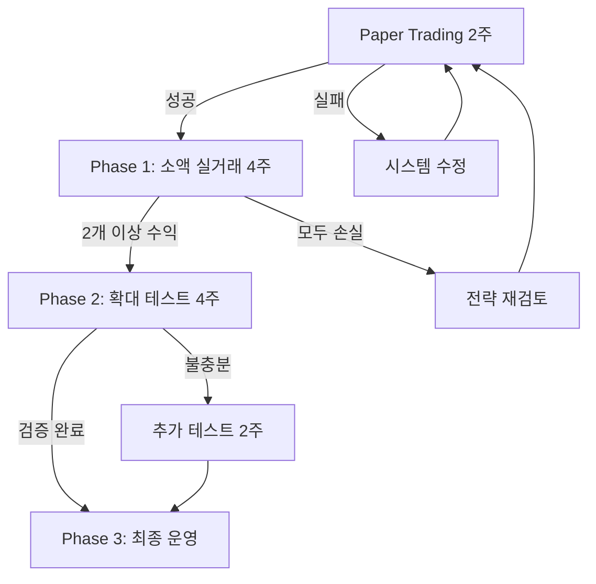

# 김치 프리미엄 차익거래 개선된 테스트 계획 v2.0
*작성일: 2025-08-24*
*외부 평가 반영 버전*

## 📌 주요 개선사항 (외부 평가 반영)

### 두 LLM 평가 종합
- **평균 점수**: 8.25/10
- **공통 지적사항**:
  1. 4주 테스트 기간이 통계적으로 불충분
  2. Paper Trading 선행 필요
  3. 리스크 관리 더 보수적으로
  4. 시장 상황별 성능 추적 필요

## 🚀 개선된 실행 로드맵

### Phase 0: Paper Trading (2주) [신규 추가]
```yaml
목적: 실거래 전 시스템 안정성 검증
기간: 2주
자본: 가상 200만원 × 4모델

주요 검증:
  - API 연결 안정성
  - 모델 간 간섭 없음
  - 비상 정지 작동
  - 주문 체결 시뮬레이션
  - 모니터링 시스템

성공 기준:
  - 시스템 가동률 > 99%
  - 각 모델 최소 50회 거래
  - 중대 오류 0건
```

### Phase 1: 소액 실거래 (4주)
```yaml
자본: 100만원 × 4모델 (기존 200만원에서 축소)
일일 손실 한도: -1% (기존 -2%에서 강화)
최소 거래 횟수: 50회/모델 (통계 유의성)

주간 체크포인트:
  Week 1: 시스템 안정성
  Week 2: 초기 성과 패턴
  Week 3: 시장 적응력
  Week 4: 중간 평가
```

### Phase 2: 확대 테스트 (4주) [기간 연장]
```yaml
자본: 상위 2개 모델 × 500만원
목적: 규모 확장성 검증

평가 항목:
  - 슬리피지 증가율
  - 대량 주문 체결률
  - 수익 일관성
```

### Phase 3: 최종 선정 (2주)
```yaml
종합 분석:
  - 10주간 누적 데이터
  - 시장 상황별 성능
  - 리스크 조정 수익
  - 최종 모델 선정
```

## 📊 강화된 리스크 관리

### 1. 다층 방어 시스템
```python
class EnhancedRiskManagement:
    def __init__(self):
        # 더 보수적인 한도
        self.limits = {
            'daily_loss': -0.01,      # -1% (기존 -2%)
            'weekly_loss': -0.03,     # -3% (기존 -5%)
            'total_loss': -0.08,      # -8% (기존 -10%)
            'consecutive_losses': 3,   # 연속 손실 횟수
            'max_position': 0.005      # 0.005 BTC (기존 0.01)
        }
        
        # 시장 상황 모니터링
        self.market_conditions = {
            'volatility_threshold': 0.03,  # 3% 변동성
            'spread_alert': 0.02,          # 2% 스프레드
            'volume_minimum': 100           # 최소 거래량 BTC
        }
```

### 2. 모델 격리 시스템
```python
class ModelIsolation:
    """모델 간 간섭 방지"""
    
    def __init__(self, model_id: str):
        self.model_id = model_id
        self.order_prefix = f"M{model_id}_"
        self.execution_delay = random.uniform(1, 3)  # 초
        self.separate_api_key = f"api_key_{model_id}"
        self.independent_db = f"db_{model_id}.sqlite"
```

### 3. 시장 상황별 추적
```python
class MarketContextTracker:
    """시장 상황별 성능 기록"""
    
    def classify_market(self, data):
        volatility = data['kimchi_premium'].std()
        trend = data['kimchi_premium'].diff().mean()
        
        if volatility > 1.0:
            vol_state = 'high_volatility'
        elif volatility < 0.5:
            vol_state = 'low_volatility'
        else:
            vol_state = 'normal_volatility'
            
        if trend > 0.1:
            trend_state = 'uptrend'
        elif trend < -0.1:
            trend_state = 'downtrend'
        else:
            trend_state = 'sideways'
            
        return f"{vol_state}_{trend_state}"
    
    def record_performance(self, model_id, market_state, metrics):
        # 시장 상황별 성능 데이터베이스 저장
        pass
```

## 📈 개선된 평가 매트릭스

### 주요 지표 (Primary)
| 지표 | 가중치 | 변경사항 | 측정 방법 |
|------|--------|----------|----------|
| Risk-Adjusted Return | 25% | 신규 | Sharpe Ratio × Total Return |
| Recovery Factor | 20% | 신규 | 총수익 / 최대낙폭 |
| Consistency Score | 20% | 강화 | 일일 수익 표준편차^-1 |
| Profit Factor | 15% | 신규 | 총이익 / 총손실 |
| Win Rate | 10% | 축소 | 수익거래 / 전체거래 |
| Execution Quality | 10% | 신규 | 체결률 × (1-슬리피지) |

### 보조 지표 (Secondary)
```python
secondary_metrics = {
    'adaptability': '시장 변화 대응 속도',
    'stress_performance': '고변동성 구간 성과',
    'api_reliability': 'API 오류율',
    'order_efficiency': '주문 체결 효율'
}
```

## 🔄 주간 검토 프로세스

### 매주 금요일 체크리스트
```markdown
## Week [N] Review

### 1. 정량 지표
- [ ] 각 모델 주간 수익률
- [ ] 거래 횟수 및 승률
- [ ] 최대 낙폭 및 회복 시간
- [ ] 시장 상황별 성능

### 2. 정성 평가
- [ ] 예상치 못한 행동 패턴
- [ ] 시스템 오류 및 대응
- [ ] 개선 필요 사항

### 3. 다음 주 계획
- [ ] 파라미터 조정 필요성
- [ ] 리스크 한도 재검토
- [ ] 추가 모니터링 포인트
```

## 💰 수정된 예산 계획

### 단계별 자본 배분
```yaml
Phase 0 (Paper): 0원 (가상)
Phase 1 (소액): 400만원 (100만원 × 4)
Phase 2 (확대): 1000만원 (500만원 × 2)
Phase 3 (운영): 4000만원 (최종 선정 모델)

총 필요 자본: 5400만원
예비 자본: 600만원 (비상용)
```

### ROI 목표
```python
# 보수적 목표 (기존보다 하향)
conservative_targets = {
    'phase_1': '손실 최소화',      # 학습 기간
    'phase_2': '월 2-3%',          # 안정화 기간
    'phase_3': '월 3-5%',          # 최적화 후
    'break_even': '3-4개월'        # 손익분기점
}
```

## 🚨 비상 대응 매뉴얼

### Level 1: 경고
```python
if daily_loss > -0.5%:
    - 포지션 크기 50% 축소
    - 진입 조건 강화
    - 실시간 모니터링
```

### Level 2: 제한
```python
if daily_loss > -0.75%:
    - 신규 진입 중단
    - 기존 포지션만 관리
    - 긴급 점검 시작
```

### Level 3: 중단
```python
if daily_loss > -1.0%:
    - 모든 포지션 청산
    - 시스템 정지
    - 원인 분석 후 재시작
```

## 📋 최종 의사결정 플로우



## ✅ 구현 우선순위

### 즉시 구현 (Week 0)
1. Paper Trading 시스템
2. 모니터링 대시보드
3. 비상 정지 시스템
4. 모델 격리 인프라

### 단계적 구현 (Week 1-2)
1. 시장 상황 분류기
2. 성능 추적 데이터베이스
3. 자동 리포트 생성
4. 슬랙/텔레그램 알림

## 🎯 성공 기준 (명확화)

### 최소 성공 (Minimum Viable)
- 1개 모델이 월 2% 달성
- 최대 낙폭 < -5%
- 시스템 안정성 > 99%

### 목표 성공 (Target)
- 2개 모델이 월 3% 달성
- 최대 낙폭 < -3%
- 명확한 우승 모델 식별

### 대성공 (Stretch)
- 1개 모델이 월 5% 달성
- 최대 낙폭 < -2%
- 확장 가능한 전략 확립

## 📝 외부 평가 반영 사항

### LLM 1 피드백 반영
- ✅ 테스트 기간 연장: 4주 → 10주 전체
- ✅ 리스크 강화: 일 -2% → -1%
- ✅ Paper Trading 추가: 2주 선행
- ✅ Monte Carlo 시뮬레이션 고려

### LLM 2 피드백 반영
- ✅ 모델 간섭 방지 시스템
- ✅ 시장 상황별 추적
- ✅ 최소 거래 횟수 기준
- ✅ Recovery Factor 추가

## 🔍 추가 검증 요청

다른 LLM에게 요청할 추가 검증:
1. Paper Trading 2주가 충분한가?
2. 100만원이 통계적으로 유의미한가?
3. 모델 격리가 완전한가?
4. 비상 대응이 충분히 빠른가?
5. 성공 기준이 현실적인가?

---

*이 계획은 외부 평가를 반영하여 더욱 보수적이고 체계적으로 개선되었습니다.*
*실행 전 최종 검토와 승인이 필요합니다.*